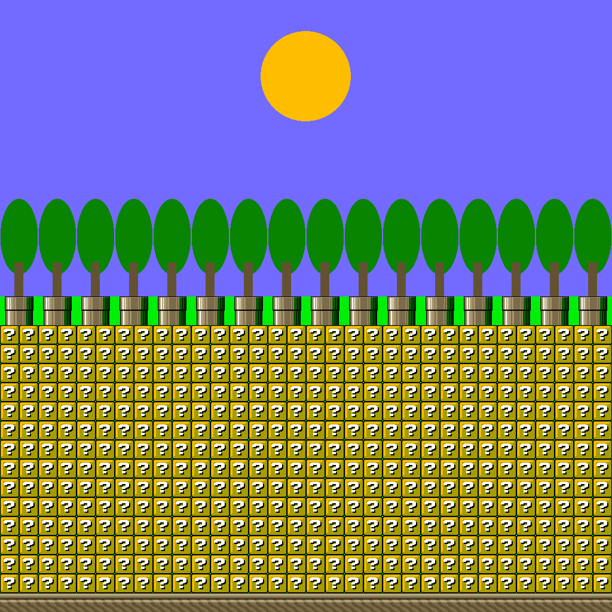
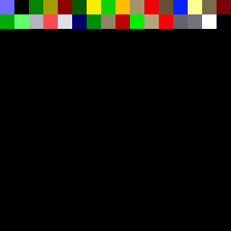

# Compare, measure, export

The subcommands built on top of a run: capture consecutive frames,
compare two ROMs, measure what the code costs, compare with another
emulator, sweep a folder of ROMs, export the music and the graphics, run
a test suite.

## `luna frames` — consecutive-frame capture (temporal artefacts)

```
luna frames [OPTIONS] <ROM>
```

Captures a run of consecutive PPU frames as PNGs through the same render
path the GUI uses — for flicker / page-flip-desync bugs a single
screenshot can't show. Each PNG is tagged with its frame number and the
forced-blank flag.

| Option | Default | Purpose |
|---|---|---|
| `-n, --steps <N>` | `1000` | Warm-up instructions before capture begins. |
| `--from-frame <F>` | — | Start the capture at PPU frame `F` (the first PNG is frame `F`; `-n` is then ignored). Frame-indexed like `state --until-frame`. |
| `--power-on <S>` | `zero` | What RAM holds before the ROM boots: `zero`, `ones`, `random` (seed derived and printed) or `random=<seed>`. See *Power-on memory state* above. |
| `-c, --count <N>` | `8` | Number of consecutive frames to capture. |
| `--out-dir <DIR>` | `/tmp/luna_frames` | Output directory (created if absent). |
| `--force-mapper <M>` | auto | As in `state`. |
| `--force-region <R>` | header | As in `state`. |
| `--input <SCRIPT>` | — | Joypad-1 script ([input scripts](input-scripts.md)). Checkpoints inside the warm-up spend from `-n` exactly as in `state` (or are chased frame by frame under `--from-frame`); later ones fire during the capture, on their own frame. |

## `luna diff` — two ROMs at equal PPU frame (MATCH / DIFF)

```
luna diff <ROM_A> <ROM_B> --frames 200,400 [--tolerance N] [OPTIONS]
```

The "compare at equal frame" protocol that validates a compiler or
library change: both builds run side by side in one process, the
displayed frame is hashed at every PPU frame, and each requested frame
prints `MATCH` when A's frame `F` equals B's frame at some `F ± tolerance`
(the boot-length offset a codegen change can introduce — the offset is
reported) or `DIFF` otherwise. Exit `0` = every frame matched, `1` = at
least one `DIFF`, `2` = usage error — the `luna test` CI contract.

| Option | Default | Purpose |
|---|---|---|
| `--frames <F,…>` | — | PPU frames to compare (required). |
| `--tolerance <N>` | `0` | Accept `b = a ± N` frames; the nearest offset wins. |
| `--input <SCRIPT>` | — | Joypad-1 script applied to **both** machines ([input scripts](input-scripts.md)). |
| `--screenshot-dir <DIR>` | — | Write `frame_<F>_a.png` / `frame_<F>_b.png` for every `DIFF` frame. |
| `--out <PATH>` | — | JSON report (`-` = stdout after the text lines): `{a, b, tolerance, frames: [{frame, status, offset?, a_hash, b_hash, screenshot_a?, screenshot_b?}], diff_count}`. |
| `--force-display`, `--native-res` | off | Hash as `run` does with the same flags. |
| `--force-mapper`, `--force-region`, `--power-on` | — | Applied to both ROMs. |

```bash
# Did the new codegen change what the game draws? Two frames, boot offset allowed.
luna diff build/old/game.sfc build/new/game.sfc --frames 200,400 --tolerance 3 \
  --screenshot-dir /tmp/diff
# frame 200: MATCH (offset +0) a=303497668ba19add b=303497668ba19add
# frame 400: MATCH (offset -1) a=6b9aeb3479655b43 b=6b9aeb3479655b43
# 2 frame(s): 2 match, 0 diff (tolerance ±3)
```

### `luna diff --sequence` — the same pictures, another cadence

```
luna diff <ROM_A> <ROM_B> --sequence [--from F1] --to F2 [--min-common N | --min-common-pct P]
```

`--tolerance N` asks whether B shows at `F ± N` what A shows at `F`. Two
harmless changes escape it: a boot that moved by more than `N` frames,
and a loop that runs freely and now fits in a frame more often, so that
no single offset lines the two ROMs up. `--sequence` ignores time. Every
frame of the range is hashed on both machines, each run of identical
frames counts as one *picture*, and the longest run of pictures the two
ROMs show **in the same order** is measured. `SAME-SEQUENCE` when that
run reaches the threshold, `DIFF` otherwise; exit `0` / `1`, `2` for a
usage error.

| Option | Default | Purpose |
|---|---|---|
| `--sequence` | off | Compare the sequence of pictures. Excludes `--frames`, `--tolerance`, `--screenshot-dir`, `--audio`. |
| `--from <F1>` | `1` | First PPU frame of the range. |
| `--to <F2>` | — | Last PPU frame of the range (required). |
| `--min-common <N>` | — | `SAME-SEQUENCE` when the common run holds at least `N` pictures. |
| `--min-common-pct <P>` | `90` | …or at least `P` percent of the pictures of the ROM that shows fewer of them. One threshold or the other. |
| `--input`, `--force-display`, `--native-res`, `--force-mapper`, `--force-region`, `--power-on` | — | As for the frame comparison. |
| `--out <PATH>` | — | JSON report: `{a, b, from, to, side_a: {pictures, frames_per_picture}, side_b: {…}, common_run: {pictures, a_frame, b_frame, offset, pct_of_shorter}, min_common \| min_common_pct, status}`. |

```bash
# The compiler made a sprite-copy loop faster: it now fits in one frame
# more often. --frames 200,400 --tolerance 40 says DIFF twice.
luna diff build/old/starfield.sfc build/new/starfield.sfc --sequence --to 200
# frames 1-200
# A: 100 pictures, frames per picture [1, 2]
# B: 165 pictures, frames per picture [1, 2]
# longest common run: 98 pictures in the same order (from frame 6 in A, frame 6 in B, offset +0)
# 98 of 100 pictures (98.0% of the shorter sequence, at least 90% asked): SAME-SEQUENCE
```

98 of A's 100 pictures are in B, in order: the same animation, and B gets
through it faster. `frames per picture` lists the distinct durations (the
first and last picture, cut by the range, are left out), and `offset` is
the frame the run starts at in B minus the frame in A — the boot offset,
when that is all that moved.

**Read the counts, not only the verdict.** Two unrelated ROMs share one
picture, the black screen of their boot: `1 of 100 pictures`, `DIFF`. But
a range that covers nothing except that black screen is one picture on
each side, and `1 of 1` is `SAME-SEQUENCE`. Choose a range in which the
program draws something, or ask for a count with `--min-common`.

### `luna diff --audio` — the same sound, a few samples apart

```
luna diff --audio <ROM_A> <ROM_B> --until-frame N [--window-ms 500] [--tolerance-pct 2]
```

A hash of the audio output is a good tripwire and a poor judge: it flips
as soon as the code that talks to the SPC700 moves by a few CPU cycles,
because the same sound then comes out a handful of samples earlier or
later. `--audio` is the comparison that survives that. Both ROMs run to
`--until-frame` (the capture `run --until-frame N --audio-out` writes),
the output is cut into windows, and each window's RMS level is compared.
`MATCH` when every window is within the tolerance, `DIFF` otherwise;
same exit codes as above.

| Option | Default | Purpose |
|---|---|---|
| `--audio` | off | Compare the sound instead of the frames. Excludes `--frames`, `--tolerance`, `--screenshot-dir`, `--force-display`, `--native-res`. |
| `--until-frame <N>` | — | PPU frame both ROMs run to (required). |
| `--window-ms <MS>` | `500` | Window length. Only windows complete on **both** sides are compared: the two captures end a few samples apart, and a last window partial on one side and empty on the other is not a difference in the sound. Captures too short for one window are compared as a single window over their common length. |
| `--align-onset` | off | Start the windows at each ROM's first sample above `--silence` instead of at sample 0, and report the shift between the two (see below). |
| `--tolerance-pct <P>` | `2` | Largest difference a window may show, in percent of the louder of the two levels. |
| `--silence <LEVEL>` | `64` | Sample level counted as silence (of 32767): the threshold of the reported onset, and the floor differences are measured against, so two near-silent windows are not a 100 % difference over one LSB. |
| `--input`, `--out`, `--force-mapper`, `--force-region`, `--power-on` | — | As for the frame comparison. The JSON report is `{a, b, until_frame, window_ms, tolerance_pct, silence, samples_a, samples_b, onset_a, onset_b, align_onset, onset_shift, length_mismatch, windows: [{start_ms, rms_a, rms_b, delta_pct}], max_delta_pct, status}`. |

```bash
# Two builds of a music player; the second adds two instructions to its init.
# Their audio hashes differ. Is it the same sound?
luna diff --audio build/old/music.sfc build/new/music.sfc --until-frame 300
# window      0 ms: a=     0.00 b=     0.00 delta=0.00%
# window    500 ms: a=     0.00 b=     0.00 delta=0.00%
# window   1000 ms: a=  5491.35 b=  5491.35 delta=0.00%
# window   1500 ms: a=  5716.50 b=  5716.44 delta=0.00%
# window   2000 ms: a=  4510.42 b=  4508.98 delta=0.03%
# …
# first sample above 64: a=32384 b=32384 (of 159936 / 159936)
# 10 window(s) of 500 ms, max delta 0.04% (tolerance 2%): MATCH
```

**The same sound, a frame earlier.** A few samples of shift disappear in
a 500 ms window; a whole frame does not. When the code that starts the
music gains a frame, the sound comes out 536 samples sooner, and the
window that holds the start compares 500 ms of music with 483 ms: a
`DIFF`, for a sound nobody could tell apart. `--align-onset` starts each
capture's windows at its own first sample above `--silence`, and the
verdict line names the shift:

```bash
luna diff --audio --align-onset build/old/music.sfc build/new/music.sfc --until-frame 300
# window      0 ms: a=  4000.99 b=  4000.54 delta=0.01%
# window    500 ms: a=  1639.02 b=  1639.02 delta=0.00%
# …
# first sample above 64: a=47906 b=47370 (of 159936 / 159936)
# 7 window(s) of 500 ms, max delta 0.09% (tolerance 2%), onset shift -536 samples: MATCH
```

Without the option the same two ROMs read `max delta 85.24%: DIFF`. The
shift is `b - a`: negative when B starts sooner. If only one of the two
captures is silent there is nothing to align, and the verdict is `DIFF`.

**A capture that stops short** is a `DIFF` whatever its windows say: both
ROMs ran to the same frame, so one capture a whole window shorter than
the other is a machine that halted, not a late sound. The report says so
(`length_mismatch`).

**What it does not see.** It compares a loudness envelope, not a
spectrum: a wrong note played at the same level passes. Keep the hash as
the signal that something moved, and use this to say how much. Two
silent captures also `MATCH` (the onset line then reads `none`), so
check that line when a ROM is expected to play.

## `luna profile` — real master cycles per symbol

```
luna profile [OPTIONS] <ROM>
```

Where the time goes, measured rather than estimated: every step credits
its master cycles — bus + internal cycles **plus the DMA / HDMA / refresh
stalls charged during it** — to the instruction's address, and the report
folds those onto the nearest `.sym` label at or below the PC (FastROM
mirror aware: a `00:` label catches code running in `$80:`, a `c0:`
HiROM label matches bank `$C0`). PCs no label covers fold onto their
256-byte page. Rows come heaviest first; `idle%` is the share spent
parked in `WAI` / `STP` under that label.

| Option | Default | Purpose |
|---|---|---|
| `-n, --steps <N>` | `3000000` | Instructions to profile (after `--from-frame`). |
| `--until-frame <F>` | — | Profile until PPU frame `F` instead of `-n`. |
| `--from-frame <F>` | `0` | Start at PPU frame `F` — skip the boot to profile the game loop. |
| `--input <SCRIPT>` | — | Joypad-1 script ([input scripts](input-scripts.md)). |
| `--input2` … `--input5`, `--port1`, `--port2`, `--mouse`, `--superscope` | `pad` | The same controller flags as `state`, same grammars — so a coverage run can replay a manifest that plugs a mouse or a Super Scope instead of running it with an empty port. |
| `--input-at <SYMBOL>` | — | Index the input scripts by arrivals on this routine instead of by frame ([input scripts](input-scripts.md#a-script-clocked-by-the-game-not-by-the-frame)): two builds are then profiled over the same game ticks. |
| `--sym <PATH>` | auto `<rom>.sym` | Labels to fold onto. |
| `--top <N>` | `25` | Rows printed (the JSON has them all). |
| `--out <PATH>` | — | JSON report (`-` = stdout after the table): `{rom, from_frame, end_frame, total_mclk, instructions, frames, entries: [{symbol, addr, instructions, mclk, idle_mclk, pct, pcs, per_frame: {max, max_frame, mean, frames} \| null}], budgets: [{symbol, limit, max, max_frame, ok}], frame_series: [{frame, active_mclk, idle_mclk, cpu_mclk, dma_mclk, hdma_mclk, refresh_mclk, total_mclk, nmi, lag}], worst_frames: [{…the same fields, entries: [{symbol, addr, mclk}]}], frame_summary: {frames, active_mean, active_max, active_max_frame, total_mean, lag_frames, lag_run, lag_run_frame, lag_runs: [{frame, length}], gates: [{gate, limit, value, frame, ok}]}}`. `per_frame` is the row's master cycles per **completed** PPU frame in the window: `max` (and the frame that paid it), `mean` over every completed frame (a frame the row did not run in counts 0), `frames` it ran in; `null` when no frame completed while it ran. The trailing partial frame is never counted. |
| `--frames-out <PATH>` | — | The window **frame by frame**, as CSV: `frame,active_mclk,idle_mclk,cpu_mclk,dma_mclk,hdma_mclk,refresh_mclk,total_mclk,nmi,lag`, one row per completed frame. The same rows are `frame_series` in `--out`. See *Frame by frame* below. |
| `--worst <N>` | `0` | Print the per-symbol table of the `N` heaviest frames (by `active_mclk`); they are `worst_frames` in `--out`. |
| `--max-frame-mclk <N>` | — | Gate: no completed frame may use more than `N` active master cycles, else **exit 1**. |
| `--max-lag-frames <N>` | — | Gate: at most `N` lag frames in the window, else **exit 1**. |
| `--max-lag-run <N>` | — | Gate: at most `N` lag frames **in a row**, else **exit 1** — the check for a game whose tick is allowed to take more than one frame. |
| `--budget <SYMBOL=MCLK>` | — | Gate (repeatable): the symbol's worst completed frame must not exceed `MCLK` master cycles, else **exit 1** with the frame named. A symbol the loaded `.sym` does not know is a usage error (exit 2) — a typo must not pass; a known symbol that never ran costs 0 and passes. The VBlank-budget check for CI. |
| `--gsu-pc-set <PATH>` | — | The distinct **GSU** PCs executed, same encoding as `--pc-set`, in a separate file (a GSU PC and a 65816 PC can be the same number and mean different code). |
| `--stack-floor <ADDR>` | — | Gate: the stack must never reach below `ADDR` (`0x`-hex, `$`-hex or decimal), else **exit 1**. Measured, not guessed — see below. |
| `--pc-set <PATH>` | — | Write the set of executed PCs: every distinct 24-bit address that ran an instruction in the window, sorted, one little-endian `u32` each — the raw input of a code-coverage tool (fold onto `.sym` labels or a listing on your side). |
| `--force-mapper`, `--force-region`, `--power-on` | — | As elsewhere. |

```bash
# The game loop, boot excluded: frames 120..600.
luna profile --from-frame 120 --until-frame 600 --top 5 game.sfc
# profile: frames 120..600 (480 completed), 1848213 instructions, 171536640 master cycles, 42 symbol(s)
#       %            mclk         instr   idle%     pcs   max/frame  symbol
#  61.02%       104672880        483840   99.6%       2      226410  WaitForVBlank
#  12.40%        21270530        291840    0.0%      61       48120  DrawSprites
#   7.91%        13570200         96480    0.0%      14       28271  DmaOamTable      <- the DMA burst is charged here
#   …
```

`max/frame` is the row's worst completed frame — the number that decides
whether a routine fits its VBlank. Gate on it in CI:

```bash
# The NMI handler must never cost more than 6000 master cycles in a frame.
luna profile --from-frame 120 --until-frame 600 --budget NmiHandler=6000 game.sfc
# budget: NmiHandler max 5210 mclk (frame 133) <= 6000 — ok        → exit 0
# budget: NmiHandler max 6512 mclk (frame 402) > 6000 — OVER       → exit 1
```

Read `per_frame.max_frame` from the JSON, then `luna state --until-frame
402 --screenshot` to see what that frame was doing.

### Frame by frame — which frame overran, and what ran in it

The per-symbol maxima do not fall on the same frame, so their sum is an
upper bound, not a measurement: it cannot say "frame 263 was the heavy
one". The frame series can. Every completed frame of the window gets one
row:

| Column | Meaning |
|---|---|
| `active_mclk` | What the program used: `cpu_mclk` (instructions) + `dma_mclk` (the DMA it started). |
| `idle_mclk` | CPU parked in `WAI` (or `STP`): the frame's headroom. |
| `hdma_mclk`, `refresh_mclk` | HDMA stalls, and the DRAM refresh (40 master clocks a line). |
| `total_mclk` | The four above added up: the frame's length (357 368 on NTSC, give or take the short line). |
| `nmi` | The NMI was raised in this frame. |
| `lag` | A **lag frame**: the NMI came while the CPU was executing, not parked in `WAI` — the main loop had not finished its frame. |

A step that crosses the frame edge is split at the edge, a DMA burst
included, so each row is the frame's own time. `lag` is meaningful for a
main loop that waits for VBlank with `WAI` (OpenSNES's `WaitForVBlank`
does); one that polls a flag is executing at every NMI, and reads `idle`
0 everywhere.

```bash
# A game whose tick is meant to take two frames, measured over 12:
luna profile --from-frame 2 --until-frame 14 --top 3 \
  --frames-out frames.csv --worst 1 --max-lag-run 1 game.sfc
# …the per-symbol table…
# frames: 12 completed, active mean 247123 mclk of 357366 a frame, max 346888 (frame 4); 8 lag frame(s), longest run 2 (from frame 4)
# lag runs of 2 or more: 3 (from frame 4, 7, 10)
# gate: max-lag-run 2 (frame 4) > 1 — OVER                          → exit 1
# worst frame 4: active 346888 mclk (cpu 346888, dma 0), idle 0, hdma 0, lag
#  99.99%          357318  tick
#   0.01%              44  nmi
```

Three gates, for CI:

- `--max-frame-mclk N` — no frame may use more than `N` active master
  cycles. For a loop that must fit one frame with room to spare.
- `--max-lag-frames N` — at most `N` lag frames in the window. `0` for a
  game that must never drop a frame.
- `--max-lag-run N` — at most `N` lag frames in a row. A tick that takes
  two frames lags every other frame by design: `--max-lag-run 1` passes
  it and fails the tick that spills into a third, which a lag *counter*
  cannot tell apart.

`--worst N` is the breakdown of the heaviest frames. A row there is a
symbol's cost in that one frame, `WAI` time included; a step that
crosses the frame edge is credited whole to the frame it ends in, as in
`max/frame`, so the rows can differ from `total_mclk` by that one step.
For any other frame `F` the series pointed at, profile it alone:
`--from-frame F --until-frame F+1`.

## What a Super FX job cost

A renderer's frame budget is per **job** — everything between the GSU's GO
and the STOP that ends it — not per frame, because a frame may run several.
`luna profile` reports them:

```bash
luna profile --from-frame 60 --until-frame 120 --top 0 game.sfc
# gsu: 184 job(s), 3507194 instr, 11175728 clocks (99.9% cache hits, 356300 stalled)
# gsu: worst job #0 — 959024 clocks, 431964 instr, 0 stalled
```

The `--out` JSON carries every job under `gsu.per_job`
(`seq, start_mclk, end_mclk, gsu_cycles, instructions, cache_hits,
cache_misses, stall_cycles`), plus the totals and the worst job by clocks.

**`stall_cycles` is the figure to look at first.** It counts clocks the GSU
was running but parked, waiting for the CPU to release ROM or Game Pak RAM
(`SCMR` `RON` / `RAN` not granted) — the difference between a job that was
slow and one that was blocked, which a total cannot tell you.

There is no "CPU cycles waiting for the GSU" counterpart, because there is
nothing to count: a 65816 read of a cartridge the GSU owns is not stalled,
on hardware or here — it gets the busy vector or open bus immediately and
carries on (see below). For wall-clock budgeting use `start_mclk` /
`end_mclk`; the gaps between jobs are CPU-only time.

## How fast the SA-1 actually runs

"The SA-1 runs at 10.74 MHz, three times the S-CPU" is true for code
running out of its I-RAM. Every access to a resource the S-CPU is using at
the same moment costs extra — one step when both are in ROM, two when both
are in BW-RAM or I-RAM (ares' `conflict()` model) — so ROM-against-ROM code
can fall to half speed. `luna profile` measures which case you are in:

```bash
luna profile --from-frame 60 --until-frame 180 --top 0 game.sfc
# sa1: 4391220 instr, 21441240 clocks (0.0% idle in WAI), 20.2% of busy clocks lost to bus conflicts (rom 4324140, bwram 0, iram 13380) — ~8.57 MHz while running
# sa1: accesses 85.9% rom, 14.1% iram, 0.0% bwram, 0.0% other
```

That example lands between the two textbook figures: 86% of its accesses
are in ROM, but the S-CPU is only in ROM part of the time, so a fifth of the
clocks are lost rather than half.

Two things to read carefully:

- **Idle time is reported apart.** Clocks spent parked in `WAI` are counted
  as clocks but not as instructions, and they are left out of the MHz
  figure: an SA-1 waiting for work is not a fast SA-1. A chip that only
  idled in the window reports `never ran`.
- **The window is the profiled one.** The counters are cumulative since
  power-on; `profile` reads them at `--from-frame` and at the end, so boot
  does not skew the figure. `luna state` carries the running total as
  `sa1.instructions_executed`.

The `--out` JSON has every counter under `sa1`: per-region accesses and
conflict steps, DMA and idle steps, `conflict_share`, `idle_share` and
`effective_mhz`.

## Who owns the cartridge (Super FX)

While `SCMR`'s `RON` / `RAN` bits grant the cartridge to the GSU, a 65816
read of Game Pak ROM returns a dummy "busy" byte and a read of Game Pak RAM
returns open bus. Nothing raises — on hardware or here. A program that
forgets, an NMI handler still in ROM, a routine touching `$70:xxxx`
mid-frame, silently reads garbage.

`luna state --out -` counts it under `gsu`:

```json
"gsu": { "running": true, "scmr_ron": true, "scmr_ran": true,
         "bus_violations": 0, "bus_vector_fetches": 452, … }
```

Gate on **`bus_violations`**, and note the second counter exists so you
can. A denied read of the `$FFE0-$FFFF` vector page is not a fault: the
busy vector is shaped so those fetches resolve to `$0108` (NMI) and
`$010C` (IRQ), which is exactly why Super FX titles keep their handlers in
WRAM at those addresses. Star Fox does it once a frame. Folding the two
together would make `bus_violations == 0` fail on correct code.

When the count is non-zero, `--gsu-bus-trace` names the instruction:

```bash
luna state -n 8000000 --gsu-bus-trace bus.csv "Star Fox (USA) (Rev 2).sfc"
# seq,frame,line,mclk,pc,addr,kind
# 0,149,207,53530022,$7E:4F00,$00:FFEE,vector
```

`kind` is `rom` (got the busy byte), `ram` (got open bus) or `vector` (the
interrupt mechanism above). The capture reports how many accesses it saw
as well as how many it kept, so a hit cap cannot quietly under-report.

This is also why `--peek` on cart RAM can come back `unmapped` mid-job:
the GSU owns it at that instant, and luna is reporting what the CPU would
have read.

## How deep the stack actually went

A link-time RAM budget can only *guess* how much stack a program needs, and
the guess is what fails: a stack sized at 512 bytes that really reaches 989
overwrites the globals under it, silently, and only on the path that goes
that deep. luna measures it instead — every run reports the deepest the
stack got, the instruction that took it there and the frame it happened on:

```bash
luna profile --from-frame 120 --until-frame 600 --stack-floor 0x1C60 game.sfc
# stack: deepest S $1C23 at $00CB5B (AudioDriverBoot, frame 4) < $1C60 — UNDER   → exit 1
```

The same figure is in `luna state`'s JSON as `cpu.sp_min`
(`{sp, pc, frame, symbol}`, `null` if the run never pushed in native mode)
and in the profile JSON under `stack`.

Two rules make the number mean something, and both matter if you compare it
with your own bookkeeping. Only an instruction that **lowers** `S` — a push
— can move the mark, so a value the program merely inherited or loaded with
`TXS` is not counted. And it is tracked only in **native** mode, because
emulation mode pins `S` to page 1 in hardware: every ROM carries `S = $01FF`
out of reset until it installs its real stack, and counting that would peg
the mark at `$01FF` for the whole run, below any floor worth checking.

`profile` starts the measurement at `--from-frame`, so the figure is the
window's and not the boot's; `state` measures from reset.

`WaitForVBlank` at 61 % idle is the frame's headroom (the same number
`stats.last_frame.cpu_wai` gives); a DMA burst's cost lands on the
instruction that triggered it, so a "cheap" `STA $420B` routine can top
the table — that is the real cost.

```bash
# Coverage: which addresses ran at all between frames 120 and 600?
luna profile --from-frame 120 --until-frame 600 --pc-set /tmp/pcs.bin game.sfc
# pc-set: 4182 distinct PCs -> /tmp/pcs.bin
python3 -c "import struct,sys; d=open('/tmp/pcs.bin','rb').read(); \
  print(*('%06X' % pc for (pc,) in struct.iter_unpack('<I', d)), sep='\n')" | head
```

Unmapped or WRAM-resident code is listed as it ran (`$7E:xxxx`, `$80:`
FastROM mirrors and all): fold the mirrors yourself if your listing is in
`$00:` terms.

> **Local labels split a routine's row.** An assembler that emits its
> internal labels (WLA-DX writes `NmiHandler@oam_done`, `@mp5_done`, …)
> gives each one its own row, because every PC folds onto the *nearest*
> label at or below it — so `--budget NmiHandler=…` would gate the entry
> stub alone. Measure the whole routine by handing `--sym` a copy of the
> symbol file with the child labels stripped; summing the printed rows
> instead would be wrong twice over (the maximum of a sum is not the sum
> of maxima, and children below `--top` are not printed).
> (Found by `OpenSNES`, 2026-09-17: 652 mclk for the stub vs 7258 for the
> handler.)

## `luna wram-trace` — cross-emulator state differential

```
luna wram-trace [OPTIONS] <ROM>
```

Emits per-frame (vblank-aligned) FNV-1a hashes of each WRAM page. With no
input, WRAM-at-vblank-N is the **same game-frame** in luna and a
reference emulator, so the first differing frame pins the first real
state divergence (THE method's confound-free oracle). Line format:
`<ppu_frame> <h0> <h1> … <hN>`.

| Option | Default | Purpose |
|---|---|---|
| `-n, --steps <N>` | `0` | Warm-up instructions before frame 0. |
| `-c, --count <N>` | `300` | Consecutive frames to hash. |
| `--page-size <BYTES>` | `4096` | Page size (power of two dividing `0x20000`). |
| `--out <PATH>` | `/tmp/luna_wram_hashes.txt` | Hash-table output. |
| `--dump-frame <N>` | — | Also dump the full 128 KiB WRAM as raw `.bin` at frame `N`. |
| `--dump-out <PATH>` | `/tmp/luna_wram_frame.bin` | Where the `--dump-frame` snapshot goes. |
| `--force-mapper <M>` | auto | As in `state`. |
| `--force-region <R>` | header | As in `state`. |
| `--input <SCRIPT>` | — | Joypad-1 script ([input scripts](input-scripts.md)). |

## `luna bench` — whole-corpus compatibility report

```
luna bench [OPTIONS] [DIR]
```

Runs every `.sfc`/`.smc` in `DIR` headless, detects anomalies (crashes,
freezes, dead APU, missing firmware) panic-safely, and writes a
compatibility report + one markdown bug file per finding. Reports stay
local (gitignored under `--out`).

| Option | Default | Purpose |
|---|---|---|
| `[DIR]` | `tests/roms` | Directory of ROMs to scan. No ROM ships with luna: point it at your own dumps. |
| `--out <DIR>` | `tests/roms/bench` | Output dir for `report.md`, `bugs/*`, `screenshots/*`. |
| `-f, --frames <N>` | `600` | Frames to run per ROM. |
| `--input <SCRIPT>` | Start-pulse | Override the default title-clearing input ([input scripts](input-scripts.md)). |

## `luna spc-dump` — export a `.spc` sound file

```
luna spc-dump [OPTIONS] <ROM>
```

Runs the ROM until its music driver is playing, then writes the live APU
state as a `.spc` file (`SNES-SPC700 Sound File Data v0.30`): SPC700
registers + 64 KB ARAM + 128 DSP registers + IPL ROM, playable in any SPC
player. Step far enough in — and pulse Start via `--input` — that the
music has started before the snapshot.

| Option | Default | Purpose |
|---|---|---|
| `<ROM>` | — | Path to the ROM. |
| `-n, --steps <N>` | `5000000` | CPU instructions before the snapshot. |
| `-o, --out <PATH>` | `<rom-stem>.spc` | Output path for the `.spc`. |
| `--force-mapper <M>` | auto | As in `state`. |
| `--force-region <R>` | header | As in `state`. |
| `--dsp1-rom <PATH>` | — | Install `dsp1b.rom` then load (DSP-1 games). |
| `--input <SCRIPT>` | — | Joypad-1 script applied before the snapshot ([input scripts](input-scripts.md)). |

```bash
luna spc-dump "game.sfc" -n 8000000 -o /tmp/song.spc
```

## `luna assets-dump` — export the loaded graphics as PNGs

```
luna assets-dump [OPTIONS] <ROM>
```

Runs the ROM to a scene, then writes every graphics asset **currently
loaded** as PNGs: `screen.png`, `vram_tiles.png` (the whole 64 KB VRAM as
a tile sheet), `bg1..4_tilemap.png` (only the layers enabled in the
current mode; Mode 7 → one `bg1_tilemap_mode7.png`), `palette.png`, and
`sprites.png` (the 128 OAM sprites at native size, transparent). Also
raw `vram.bin` / `cgram.bin` and `oam.json` (sprite metadata).

> **This captures only what is loaded at that instant** (already
> decompressed by the game). Snapshot several scenes — different `-n`
> or `--until-frame`, or `--input` to reach them — to cover a whole game. A static
> whole-ROM rip is **not** possible: SNES graphics are
> game-specific-compressed with no standard layout.

| Option | Default | Purpose |
|---|---|---|
| `<ROM>` | — | Path to the ROM. |
| `-n, --steps <N>` | `5000000` | CPU instructions before the snapshot. |
| `--until-frame <F>` | — | Run to PPU frame `F` instead, as `state --until-frame` does. The frame reached under `-n` depends on how fast the code is; this takes the assets at the frame a test manifest checks. Excludes `-n`. |
| `--out <DIR>` | `/tmp/luna_assets` | Output directory (created if absent). |
| `--bpp <2\|4\|8>` | auto (BG1 mode) | Bit-depth for the VRAM tile sheet. |
| `--palette <N>` | `0` | CGRAM sub-palette row for the tile sheet (2/4bpp). |
| `--force-mapper <M>` | auto | As in `state`. |
| `--force-region <R>` | header | As in `state`. |
| `--dsp1-rom <PATH>` | — | Install `dsp1b.rom` then load (DSP-1 games). |
| `--input <SCRIPT>` | — | Joypad-1 script applied before the snapshot ([input scripts](input-scripts.md)). |

```bash
luna assets-dump "game.sfc" -n 8000000 --out /tmp/assets

# The VRAM a manifest with `frames = 200` asserts on, to read a block back.
luna assets-dump "game.sfc" --until-frame 200 --out /tmp/assets
# assets @ frame 200 (BGMODE $02, tile sheet 4bpp):
#   /tmp/assets/screen.png (5842 bytes)
#   …
```

Two of the files it writes for a Mode 7 test ROM, `bg1_tilemap_mode7.png`
and `palette.png`:

<div class="captures">
<figure><figcaption>The tilemap, before the PPU transforms it</figcaption></figure>
<figure><figcaption>CGRAM, sixteen entries per row</figcaption></figure>
</div>

## `luna test` — manifest-driven homebrew tests

```
luna test [OPTIONS] [PATHS]...
```

Runs one TOML manifest per test (ROM, input, run bound, asserts) in
process, and exits `0` when every manifest passes, `1` on an assert
failure, `2` on a manifest or usage error. `[PATHS]` are manifest files or
directories scanned for `*.toml` (default `./tests`). The machine is set
per manifest, not by flags (`region`, `force_mapper`, `power_on`, `seed`).

| Option | Default | Purpose |
|---|---|---|
| `--update` | off | Rewrite each manifest's `asserts.fbhash` with the measured value (regenerate goldens after an intended render change); formatting and comments are kept. |
| `--only <SUBSTR>` | all | Only run manifests whose path contains the substring. |
| `--report json` | — | Also print a machine-readable JSON report to stdout. |
| `--jobs <N>` | `1` | Run up to N manifests at once (`0` = one per CPU); same lines, same order and same exit code as a serial run. |

The manifest format, the assert families and a GitHub Actions recipe are
the subject of [Developing homebrew with luna](homebrew-ci.md).
